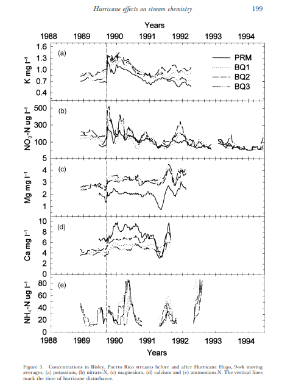

# ***Building Analytical Workflow for Scientific Reproducibility***

## Goal

Recreate Schaefer et al.[(2000)](https://doi.org/10.1017/s0266467400001358) figure 3. A time-series plot of a 9-week moving-average of streamwater concentration before and after 1989 Hurricane Hugo disturbance, based on long-term stream water quality observations in Puerto Rico.

## How to replicate this analyses

Firstly, make sure you have R installed with the following packages;

- here

- tidyverse

- janitor

- skimr

- lubridate

- dplyr

***To learn more about each library, type `?packagename` in the console to view its help page and learn more about it***

To run the analyses, clone this repository.
This GitHub repository contains all of the code associated with the project and the figure produced by this code.

Inside the following can be found;

-  [1_clean_data.R](https://github.com/IIDonaji/eds214-Repro/blob/3558ebb07ed4468eb3d0d3b50aaa8919114f908a/1_clean_data.R) 
contains all library needed, cleaned data-frames, and analysis

- [data](https://github.com/IIDonaji/eds214-Repro/tree/3558ebb07ed4468eb3d0d3b50aaa8919114f908a/data)
contains the raw data used to perform this analysis 

- [outputs](https://github.com/IIDonaji/eds214-Repro/tree/3558ebb07ed4468eb3d0d3b50aaa8919114f908a/outputs)
the model object

- [R](https://github.com/IIDonaji/eds214-Repro/tree/3558ebb07ed4468eb3d0d3b50aaa8919114f908a/R)
the function created to calculate the moving average. 

### Data
The data used in this analysis are available through the ***Environmental Data Initiative*** [(McDowell and INternational Institute Of Tropical Forest (IITF) 2024)](https://portal.edirepository.org/nis/mapbrowse?packageid=knb-lter-luq.20.4923064)

### Citation

Schaefer, Douglas. A., William H. McDowell, Fredrick N. Scatena, and Clyde E. Asbury. 2000. “Effects of Hurricane Disturbance on Stream Water Concentrations and Fluxes in Eight Tropical Forest Watersheds of the Luquillo Experimental Forest, Puerto Rico.” Journal of Tropical Ecology 16 (2): 189–207. <https://doi.org/10.1017/s0266467400001358>
